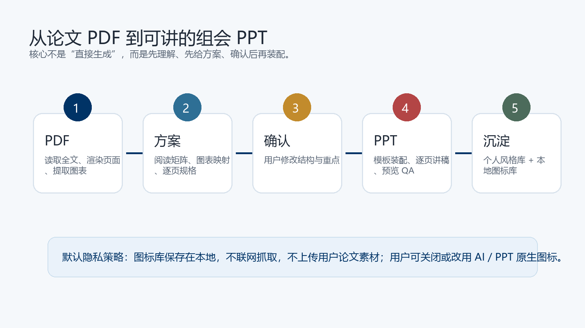
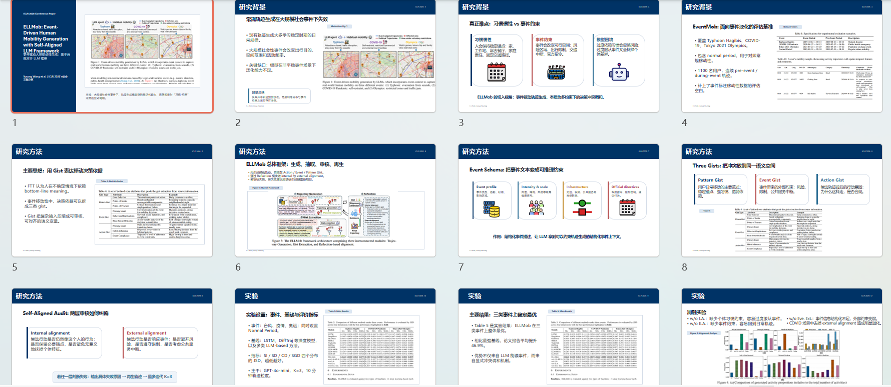

# pdf2ppt_skill

把论文 PDF 做成可汇报的组会 PPT 的 Codex Skill。

这个 skill 不只是总结论文。它会先读论文、生成文献理解矩阵、图表映射和逐页 PPT 方案，等你确认后再生成可编辑 `.pptx`、逐页讲稿、预览图和中间分析文件。



## Highlights

- 先给 PPT 方案，确认后再生成，减少返工。
- 输出可编辑 PPT，而不是截图式幻灯片。
- 每页生成 speaker notes / 讲稿，方便直接汇报。
- 使用论文 PDF 原始图表、表格、公式截图，减少错图和碎图。
- 自带通用学术默认模板，也支持上传自己的 PPT 模板。
- 支持沉淀个人版式风格库，让后续文献分享更像你的习惯。
- 会从每篇论文的图表素材中提取可复用小图标，进入本地图标库，用于后续 PPT 的视觉增强。
- 图标增强可关闭，也可以改用 AI 生成图标、PPT 原生图标或手动指定图标。
- 默认不联网抓取图标，不上传用户论文素材。

## Demo

下面是基于公开论文 ELLMob 的展示案例。该 demo 只展示输出效果，论文内容版权归原作者/权利方，详见 `THIRD_PARTY_NOTICES.md`。



## Install

Clone this repository, then copy the skill folder into your Codex skills directory:

```bash
git clone https://github.com/DAIBird-0/pdf2ppt_skill.git
cp -r pdf2ppt_skill/paper-group-meeting-ppt ~/.codex/skills/
```

On Windows PowerShell:

```powershell
git clone https://github.com/DAIBird-0/pdf2ppt_skill.git
Copy-Item -Recurse -Force .\pdf2ppt_skill\paper-group-meeting-ppt "$env:USERPROFILE\.codex\skills\"
```

Install optional helper dependencies for local scripts:

```bash
pip install -r requirements.txt
```

## Usage

PDF only:

```text
使用 $paper-group-meeting-ppt，根据这篇论文 PDF 制作中文组会文献分享 PPT。
论文：<paper.pdf>
请先生成文献阅读矩阵、图表映射和 PPT 制作方案，等我确认后再生成 PPT。
```

With your own template:

```text
使用 $paper-group-meeting-ppt，根据这篇论文 PDF 制作组会 PPT。
论文：<paper.pdf>
模板：<template.pptx>
请沿用模板风格，每页写入 speaker notes。
```

Disable icon accents:

```text
使用 $paper-group-meeting-ppt 做 PPT，但关闭图标增强，不使用历史图标库。
```

Use AI-generated icons instead:

```text
使用 $paper-group-meeting-ppt 做 PPT，图标层请改用 AI 生成的统一线性图标。
```

## Workflow

1. Extract text, rendered pages, figures, tables, and candidate visuals from the PDF.
2. Build a reading matrix: problem, gap, method, evidence, limits, likely advisor questions.
3. Map paper figures/tables/equations to slide jobs.
4. Draft page-by-page slide specs and speaker notes.
5. Ask the user to confirm or revise the PPT plan.
6. Generate the editable PPT with the chosen template and style library.
7. Render previews and inspect layout, screenshots, notes, and visual consistency.

## Repository Layout

```text
paper-group-meeting-ppt/
  SKILL.md
  agents/openai.yaml
  assets/user-default-paper-group-template.pptx
  assets/icon-library/manifest.json
  references/
  scripts/
examples/ellmob-demo/
marketing/
scripts/audit_privacy.py
```

## Privacy

The skill is designed for local research workflows. It does not need to upload papers or extracted figures to external services by default. The icon library is local by default.

Before publishing changes or demo files, run:

```bash
python scripts/audit_privacy.py .
```

The audit scans text files and PPTX internals for common personal information, local paths, tokens, API keys, PPTX metadata, undeclared demo content, slides, notes, and comments.

## Validation

```bash
python scripts/audit_privacy.py .
python -m py_compile scripts/audit_privacy.py paper-group-meeting-ppt/scripts/*.py
python paper-group-meeting-ppt/scripts/extract_pdf_materials.py --help
python paper-group-meeting-ppt/scripts/crop_pdf_region.py --help
python paper-group-meeting-ppt/scripts/harvest_icons_from_figures.py --help
python paper-group-meeting-ppt/scripts/select_icon_accent.py --help
```

If you have Codex's skill validation script available:

```bash
python quick_validate.py paper-group-meeting-ppt
```

## License

MIT for the repository code, skill instructions, scripts, documentation, and sanitized default template.

Third-party paper content in examples is not relicensed. See `THIRD_PARTY_NOTICES.md`.

